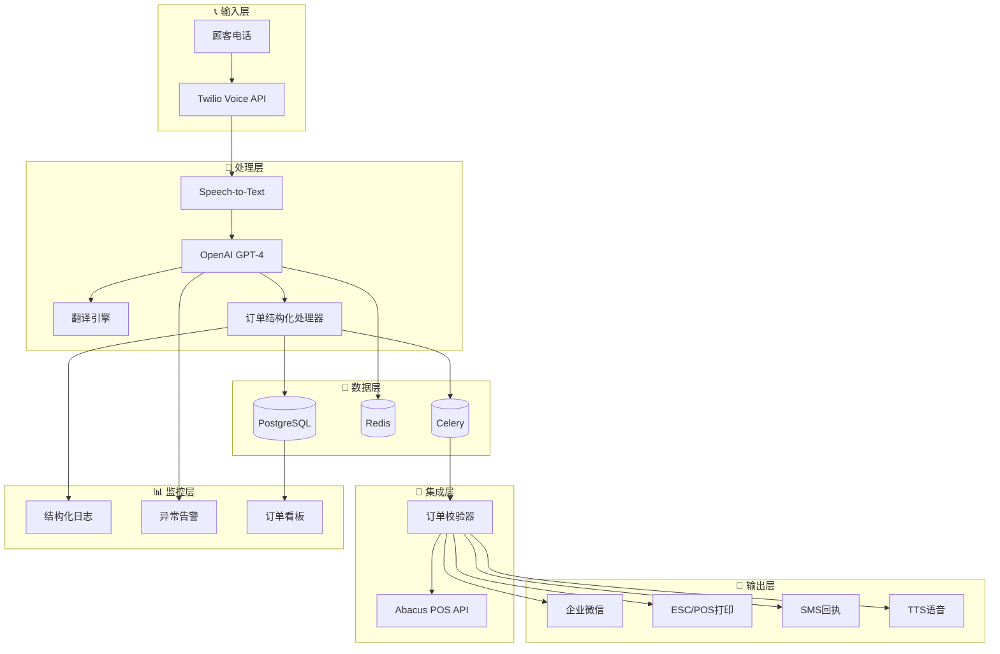

# 🥟 悉尼饺子店电话订单自动化系统 - 技术架构文档

> **版本**: v1.0  
> **日期**: 2026-03-08  
> **作者**: System Architect  
> **目标**: AI电话接线员 + 自动翻译 + 多渠道通知 + POS集成

---

## 📋 架构概览

本系统为悉尼中餐馆提供全自动电话订单处理解决方案，解决老板开车时无法手动记录英文电话订单的痛点。系统实现从电话接听到后厨通知的完整闭环。

---

## 🔧 系统架构图



---

## 📦 组件清单表

| 组件 | 用途 | 成本/月 | 实现难度 | 优先级 |
|------|------|---------|----------|--------|
| **Twilio Voice API** | 电话接入、语音转文字 | $20-50 + $0.0085/分钟 | ⭐⭐ 中等 | P0 必需 |
| **OpenAI GPT-4o** | 自然语言理解、订单解析 | $50-100 | ⭐⭐ 中等 | P0 必需 |
| **OpenAI Whisper** | 备选语音转文字 | $0.006/分钟 | ⭐⭐ 中等 | P1 备选 |
| **企业微信 API** | 后厨中文通知 | ¥0 (免费) | ⭐ 简单 | P0 必需 |
| **PostgreSQL** | 订单数据持久化 | $0 (自建) | ⭐ 简单 | P1 重要 |
| **Redis** | 电话会话状态缓存 | $0 (自建) | ⭐ 简单 | P1 重要 |
| **Celery** | 异步任务队列 | $0 (自建) | ⭐⭐ 中等 | P1 重要 |
| **Abacus POS API** | POS系统集成 | 待定 (需评估) | ⭐⭐⭐ 困难 | P2 可选 |
| **Thermal Printer** | 自动小票打印 | $80-150 硬件 | ⭐ 简单 | P1 重要 |
| **DeepL API** | 英文→中文翻译优化 | €4.99/月 | ⭐ 简单 | P2 可选 |
| **Sentry** | 错误监控告警 | $0-26 | ⭐ 简单 | P2 可选 |
| **Grafana** | 订单数据可视化 | $0 (自建) | ⭐⭐ 中等 | P3 锦上添花 |

**预计月度成本**: $70-200 (不含Abacus集成费用)

---

## 🗓️ Phase 实施计划

### Phase 1: MVP核心功能 (4-6周)

| 里程碑 | 交付物 | 验收标准 |
|--------|--------|----------|
| M1.1 | Twilio电话接入 | 可拨打测试号码，获取语音流 |
| M1.2 | 语音转文字集成 | 英文语音→文字准确率>85% |
| M1.3 | GPT订单解析 | 正确识别菜品/数量/取餐时间 |
| M1.4 | 企业微信通知 | 后厨接收中文订单通知 |
| **M1.5** | **Phase 1 MVP上线** | **完整流程跑通，真单测试** |

**技术栈**: Python + Twilio + OpenAI + 企业微信API

---

### Phase 2: 自动化增强 (3-4周)

| 里程碑 | 交付物 | 验收标准 |
|--------|--------|----------|
| M2.1 | ESC/POS小票打印 | 自动打印厨房小票 |
| M2.2 | PostgreSQL订单库 | 订单可查询/追溯/统计 |
| M2.3 | 语音订单确认 | 自动TTS回复顾客确认信息 |
| M2.4 | 异常订单人工介入 | 模糊订单转人工处理 |
| **M2.5** | **Phase 2 自动化上线** | **无人值守处理率>90%** |

**新增组件**: PostgreSQL + Redis + Celery + 热敏打印机

---

### Phase 3: POS集成与优化 (4-6周)

| 里程碑 | 交付物 | 验收标准 |
|--------|--------|----------|
| M3.1 | Abacus API可行性评估 | 确认集成方案 |
| M3.2 | POS订单自动录入 | 无需人工二次录入 |
| M3.3 | 实时订单看板 | 当日销售可视化 |
| M3.4 | 智能报告 | 热门商品/高峰时段分析 |
| **M3.5** | **Phase 3 完整系统** | **端到端自动化** |

---

## 🧭 技术决策记录 (ADRs)

### ADR-001: 电话接入方案选择 - Twilio

**决策**: 使用 Twilio Voice API

| 方案 | 优点 | 缺点 | 结论 |
|------|------|------|------|
| **Twilio** | 成熟稳定、AU号码支持、文档丰富 | 费用略高 | ✅ **选用** |
| Vapi.ai | 专为AI电话设计 | 新兴服务、稳定性未知 | ❌ 备选 |
| 自建VoIP | 成本低 | 维护复杂 | ❌ 放弃 |

**理由**: 餐馆场景对稳定性要求极高，Twilio的99.95% SLA是决定性因素。

---

### ADR-002: 语音识别方案选择

**决策**: Twilio原生语音转文字 + Whisper备选

| 方案 | 优点 | 缺点 | 适用场景 |
|------|------|------|----------|
| **Twilio Native** | 集成简单、实时性好 | 准确率中等 | ✅ **默认方案** |
| **Whisper API** | 准确率最高 | 有延迟 | 口音重的订单 |

**策略**: 默认Twilio native，置信度<85%自动转Whisper重试。

---

### ADR-003: AI模型选择

**决策**: GPT-4o-mini for parsing, GPT-4o for complex cases

```python
# 模型路由策略
if confidence > 0.9:
    model = "gpt-4o-mini"   # $0.15/1M input tokens
else:
    model = "gpt-4o"        # $2.50/1M input tokens
```

**理由**: 订单解析是结构化任务，4o-mini已足够，预计80%+订单可用mini处理。

---

### ADR-004: 通知渠道选择

**决策**: 企业微信 + TTS语音确认 + SMS回执

| 渠道 | 受众 | 用途 |
|------|------|------|
| **企业微信** | 后厨员工 | 中文订单提醒 (实时) |
| **TTS语音** | 顾客 | 订单确认、取餐时间告知 |
| **SMS** | 顾客 | 订单号回执、变更通知 |
| **热敏小票** | 后厨 | 厨房备餐凭证 |

**排除方案**: 个人微信API不稳定易被封，邮件不够即时。

---

### ADR-005: POS集成策略

**决策**: 研究Abacus API，如不可用则实行"影子并行"模式

| 方案 | 实施方式 |
|------|----------|
| **理想方案** | Abacus API直接下单 |
| **影子并行** | 系统记账，每日对账时补录Abacus |
| **手动桥接** | 系统生成Abacus录入格式，员工一键复制 |

---

## 💻 给 Coder 的模块清单

### Module 1: 电话接入模块 (`telephony/`)

```python
# Input: Twilio webhook payload
# Output: audio_stream_url, call_sid
def handle_incoming_call(request: TwilioRequest) -> CallSession:
    """
    Interface:
    - POST /twilio/voice - 处理来电webhook
    - Return: CallSession {call_sid, from_number, started_at}
    """
```

**依赖**: Twilio Python SDK, Flask/FastAPI

---

### Module 2: 语音转文字模块 (`asr/`)

```python
# Input: audio_stream (raw/streaming)
# Output: transcription text, confidence score
def transcribe(audio: AudioStream, provider: str = "twilio") -> Transcription:
    """
    Interface:
    - transcribe(audio) -> {text: str, confidence: float, language: str}
    - Supports: "twilio" | "whisper"
    """
```

**依赖**: openai-whisper, Twilio speech recognition

---

### Module 3: AI订单解析模块 (`parser/`)

```python
# Input: english_text (str)
# Output: structured order dict
def parse_order(text: str, model: str = "gpt-4o-mini") -> Order:
    """
    Interface:
    - Input: "I'd like 20 dumplings and 3 bubble teas, 15 minutes"
    - Output: Order {
        items: [{
          name: str,           # "猪肉饺子"
          name_en: str,        # "pork dumplings"
          quantity: int,
          unit_price: float,
          subtotal: float
        }],
        total: float,
        pickup_time: datetime,
        confidence: float      # AI置信度
      }
    """
```

**依赖**: OpenAI API, Pydantic for validation
**Prompt模板**: `prompts/order_parser_v1.txt`

---

### Module 4: 订单校验模块 (`validator/`)

```python
# Input: Order object
# Output: ValidatedOrder or RejectedOrder
def validate_order(order: Order) -> ValidationResult:
    """
    Interface:
    - validate(order) -> {status: "valid"|"needs_review", reasons: [str]}
    - Checks: price_range, time_valid, item_exists
    """
```

**依赖**: 菜单配置数据库 (JSON/YAML)

---

### Module 5: 通知发送模块 (`notifications/`)

```python
# Input: ValidatedOrder
# Output: notification receipts
def send_notifications(order: ValidatedOrder) -> NotificationResult:
    """
    Interface:
    - send_wechat(order) -> bool
    - send_sms(customer_phone, message) -> bool  
    - print_receipt(order) -> bool
    - speak_confirmation(call_sid, message) -> bool
    
    Events: notification.sent, notification.failed
    """
```

**依赖**: 企业微信API, Twilio SMS/TTS, python-escpos

---

### Module 6: POS集成模块 (`integrations/abacus.py`)

```python
# Input: ValidatedOrder
# Output: POS sync status
def sync_to_pos(order: ValidatedOrder) -> SyncResult:
    """
    Interface:
    - sync_to_pos(order) -> {success: bool, pos_order_id: str|None, error: str|None}
    
    [TBD based on Abacus API research]
    - Option A: Direct API integration
    - Option B: Generate CSV import format
    - Option C: Manual bridge mode
    """
```

**依赖**: Abacus API (待调研)

---

### Module 7: 数据存储模块 (`db/`)

**SQLAlchemy Models**:

```python
class Order(Base):
    """订单主表"""
    __tablename__ = "orders"
    
    id: int                    # 自增ID
    order_id: str              # 业务单号 D{HHMMSS}
    call_sid: str              # Twilio通话ID
    customer_phone: str        # 顾客电话
    total_amount: float        # 订单金额
    pickup_time: datetime      # 预计取餐时间
    status: